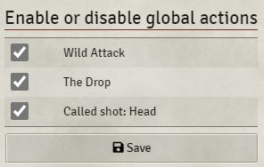
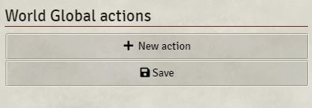
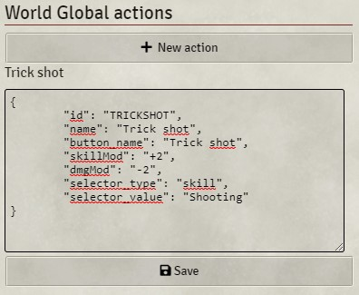

# Global actions

Global actions are pre-defined global actions that are ready to use. You can choose to disable them, if they should not be available in your setting.

## World Global actions

With the World global action functionality, you can define your own global actions for this world. You need to provide a JSON file to add them:

see [GLOBAL_ACTIONS.md](GLOBAL_ACTIONS.md) for more information on how to create global actions.