# Better Rolls 2 for SWADE

Please leave your feedback on the official Foundry discord. Feel free to ping me if you want.

Criticism, feature requests, and UI changes are all welcome but, if you want me to do something about it, please be as detailed as you can. Please, at the very least, tell me what you expect and why do you believe your approach is better.

This module adds a new rolling mode to the SWADE system that adds the ability to make faster and more complex rolls. I truly believe that it makes gaming faster and more enjoyable, but:

* This is more complex than system default rolls. It's quite likely that you don't need it. Please try SWADE without it first and only check it out if you feel rolls could be improved.
* You need to be familiar with the rules of Savage Worlds to use it. You need to know e.g. which dice are discarded and how damage is affected by raises; generally speaking, this is not a good module for beginners. It could be confusing. So, again, please use the base system and get familiar with it before using this module.

# Settings

Better Rolls 2 comes with a variety of settings:

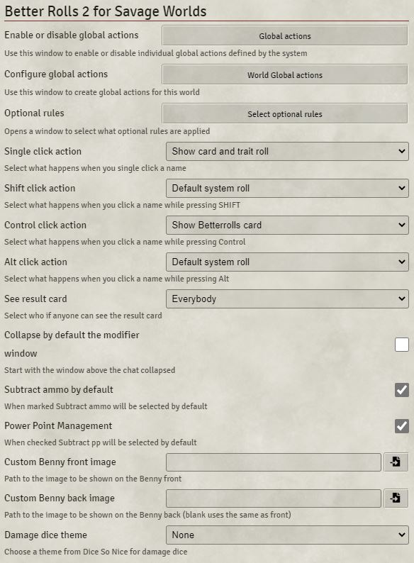

See [Settings](settings.md)

# Anatomy of a Better Rolls Card
Learn about the template for the Better Rolls cards [here](anatomy.md).

See [Anatomy of a Better Rolls Card](anatomy.md)

## Modifier row

Better Rolls 2 will add this section above the chat window

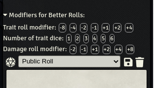

You can use this to quickly add modifiers to a roll.

You can either set a one time modifier or a persistent modifier. If you click once, the selected icon will turn white and will be deselected after one roll. Click twice, it will turn red and will apply to any roll until you deselect it.

Use the "Trait roll modifier" line to affect any trait roll either from a skill, attribute or item.

Use "Number of trait dice" to use multiple trait dice on a skill roll, either from a skill, attribute or item card.

Finally the "Damage roll modifier" adds modifiers to damage rolls.

If you prefer to hide this section, you can find an option to collapse it by default in the settings.

## Card types

### Attribute card

This is the card that is shown after clicking on an attribute name:

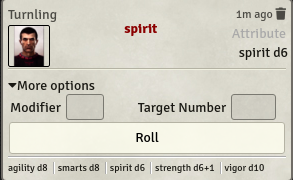

### Skill card

The skill cards are very similar to attribute ones. Please note the collapsed skill description. When rolling multiple Trait dice + Wild die it will show all results.

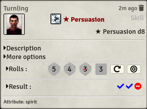

### Item cards

Item Cards can be broken down into different categories. Gear cards are straightforward, while weapon or power cards add a lot of functionality.

A simple item, like an armor would look like this:

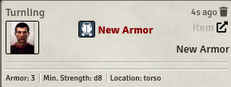

If there is a description available, it will show it.

#### Edges and Hindrances

Edges and Hindrances, being treated as items in Foundry VTT have the same look:

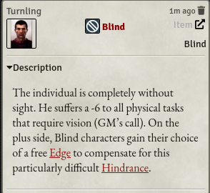

#### Melee weapons

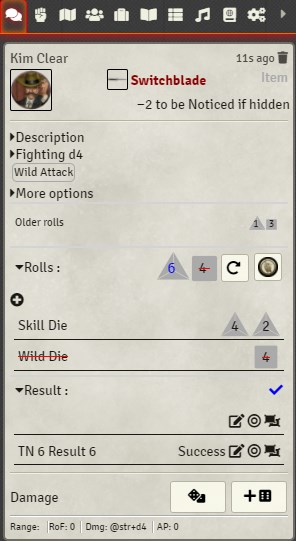

In this example, the damage has already been rolled. The roll will than be compared with the TN. This is usually 4, but if you have targeted another actor, it will use that actors Parry instead. As described earlier, you can use a reroll or a Benny to alter your result - all earlier rolls will be added to the "Older rolls" row above the rolls section.

If you are satisfied with your skill roll, you can go ahead and roll damage (either normal damage or raise damage):

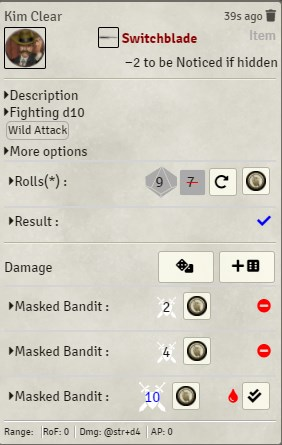

As you can see, you can also use a Benny to reroll the damage, this will add a new row as shown above. If the damage is sufficient to cause a wound or make an opponent shaken, you will also see the "Apply damage" box. If targeted, the damage roll will be compared against the targets Toughness. (see "Soak Rolls" below)

#### Ranged weapons

Ranged weapons work similar than melee weapons but their TN is always 4, if not modified in the "More options" section. In the sample below, *Vulnerable* as well as *Distracted* has been factored in this roll:

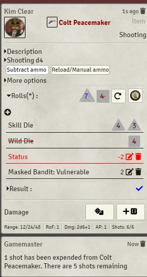

Please note the "subtract ammo by default" setting in action. If you selected this option in the Settings, the "Subtract ammo" global action will be selected by default and automatically spend an amount of shots based on the amount of Trait die used (1/5/10/20/40/50). With the "Reload/Manual ammo" option you can define an amount of shots you want to reload or fire (like 6 if you want to fan the hammer in a *Deadlands* session). The weapon cannot load more bullets than its maximum capacity though.

#### Power cards

Power cards are very similar to ranged weapons (if they have damaging effects).

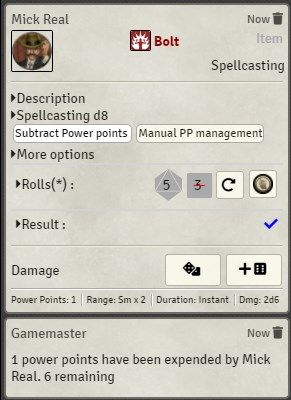

Available global actions are "Subtract Power points" - can be activated in the settings as default and "Manual PP management". The automatic solution will always deduct the base amount defined in the power. With the second option you can manually either expend or recharge Power Points

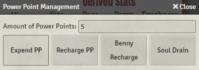

### Soak Rolls

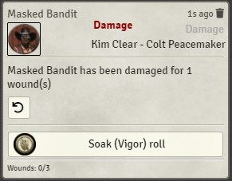

When an actor has been targeted and damaged using the "Apply damage" button, the "Soak card" will appear. This will allow the actor to make a "Soak (Vigor) roll" to spend a Benny and soak damage. This will only be available, if there are Bennies left to spend.

## More functionalities

### Drag and Drop

You can also use the weapon or power icon to drag it over the actor you want to target. It will execute the "Show card and trait roll" action.

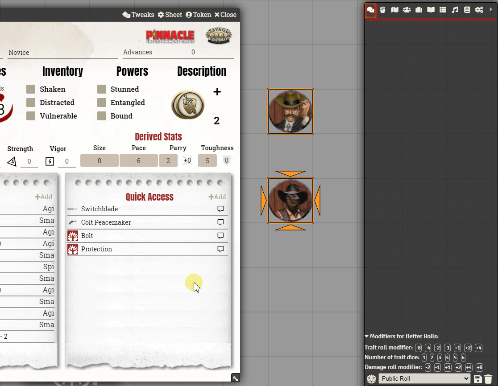

For easier accessability, instead of dragging the icon on an actor, you can also drag it to the macro bar, creating an automatic macro instead.

### Custom Bennies

The module comes with some custom bennies that can be found in the assets/bennies folder.

Currently, it ships with some classical roman and greek coins.

### Global actions.

The module let's you define your own actions, see this [docs](GLOBAL_ACTIONS.md):

### Macros and API

The following information assumes a passing knowledge of both javascript and Foundry API. It's geared towards macro or module developers.

The module exposes an API in game.brsw.

# Other Modules

## Integrations

* **Dice so Nice:** This module supports using a different theme for the damage dice when you are using Dice so Nice. You can select it in the module settings (see above)
* **Dice Tray:** If Dice Tray is enabled, better rolls will use it's modifier box in addition to all other options.

## Recommendations

Better Rolls for SWADE works well with the SWADE Toolkit module: https://foundryvtt.com/packages/swade-toolkit/

## Known incompatibilities

* SWADE Tools and Better Rolls implement similar things in very different ways. Since both modules affect the same functionalities, neither can live while the other survives (please don't have them active at the same time).
* ModBox and Better Rolls do not work together

# About
See [About](About.md) for Authors, Translations, Acknowledgements, License, etc.